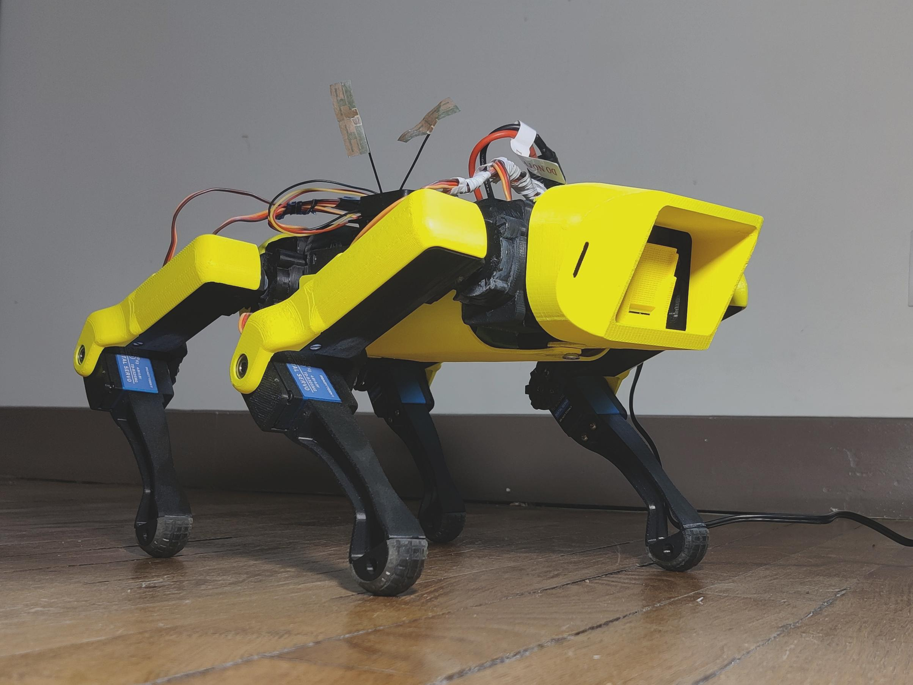
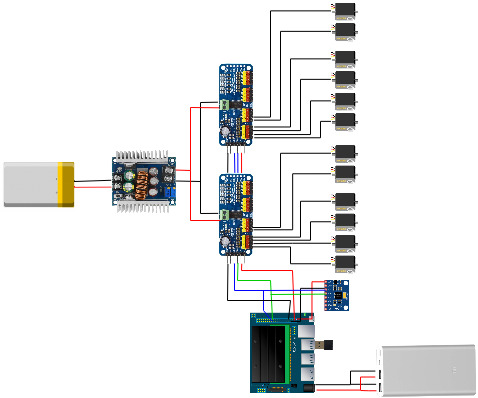

### Note
This is a fork of the [OpenQuadruped](https://github.com/OpenQuadruped/spot_mini_mini) repository.

Important changes are:
- The the use of the original yellow SpotMicroAI configuration, with the improved motor parameters from OpenQuadruped.
- The Soft Actor-Critic (SAC) agent implementation is removed of bugs and put in the same training and test setup as the ARS agent.  
- The real robot is now integrated with the MPU5060 IMU. Data is collected through Ros.
- Motor control of the real robot is performed using the PCA9685 PWM drivers
- The robot is controlled with the Jetson Nano

Furthere code explanation and clean up will follow

For more information visit my website: TODO
# The electronical schematic:

